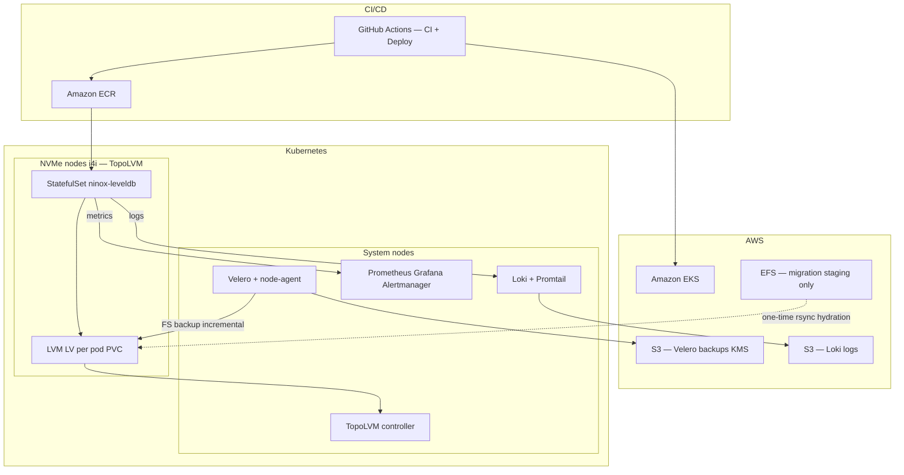

# Ninox LevelDB on Kubernetes — Architecture

This document maps the proof-of-concept to the evaluation criteria: resilience, backup/RPO, scaling, migration, observability, and security.

## High-level diagram

## Component roles

| Layer | Choice | Why |
|--------|--------|-----|
| **Cluster** | Amazon EKS | Managed control plane, IRSA, KMS, mature CSI ecosystem |
| **Block storage** | **TopoLVM** on NVMe (LVM thin pool) | On-demand LVs from a volume group; `WaitForFirstConsumer` pins pod + volume to the same node — required for LevelDB local disk semantics |
| **Backup engine** | **Velero** with **node-agent** + `defaultVolumesToFsBackup` | File-system backup of mounted PVC data to S3; Velero 1.12+ uses the **Kopia** uploader (same operational model as legacy Restic: deduplicated incremental chunks to object storage). Challenge wording “Restic” = this class of backup |
| **RPO** | `Schedule` **every 6 hours** (`0 */6 * * *`) | Meets **6 h RPO**; alerting if no success within ~7 h |
| **CI/CD** | GitHub Actions — lint, test, Trivy, ECR push; deploy workflow for Helm | Keeps supply chain and deploy auditable |

## Resilience and recovery

- **Pod failure**: StatefulSet replaces the pod; PVC reattaches to the same logical volume on the same node (RWO + topology).
- **Node failure**: Pod reschedules; **new** PVC cannot attach old LV on another node without restore — for LevelDB this is expected: **one replica = one shard**; design uses **multiple replicas** (default 3) on **different nodes/AZs** so the service stays up; failed node data is restored from Velero (see [backup-restore-lvm-restic.md](backup-restore-lvm-restic.md)).
- **Stale LOCK**: `init-leveldb-lock` removes LevelDB `LOCK` after crash.
- **Probes**: `startup`, `readiness` (`/ready`), `liveness` (`/healthz`) on the app container.
- **Disruption**: PodDisruptionBudget preserves quorum during voluntary evictions.

## Scalability (trade-offs)

| Approach | Fits LevelDB? | Notes |
|----------|----------------|-------|
| **HPA (replicas)** | Only if each replica is an **independent** dataset (sharded by key range or separate DBs). | Default chart is **N independent LevelDB instances** — horizontal scale **does not** merge one DB across pods. |
| **VPA (CPU/memory)** | **Yes** for compaction / request spikes. | Chart includes VPA in **Off** mode by default; tune after baseline, then **Auto** cautiously (evictions restart pods). |
| **Vertical node scale** | **Yes** | Move to larger **i4i** SKUs if single-replica CPU or **LV** throughput is the bottleneck. |

## Security & tooling (summary)

- **IRSA** for Velero, Loki, app (no long-lived node credentials).
- **KMS** for S3 (Velero bucket), EBS, cluster secrets.
- **Pod security**: non-root, `readOnlyRootFilesystem`, dropped caps, `RuntimeDefault` seccomp.
- **Network**: private API option in Terraform; workloads on dedicated tainted NVMe nodes.

## Pipelines

- **CI** (`.github/workflows/ci.yaml`): Helm lint, Terraform fmt, Go tests, Docker build, Trivy CRITICAL gate, optional ECR push on `main` / semver tags.
- **Deploy** (`.github/workflows/deploy.yaml`): Terraform apply (optional skip) + `helm upgrade --atomic` + smoke + optional Velero backup + Slack.

For deeper backup/restore steps and performance tuning, see [backup-restore-lvm-restic.md](backup-restore-lvm-restic.md).

## Upgrade note (StatefulSet PVC templates)

If you previously deployed a chart revision that defined **two** `volumeClaimTemplates`, Kubernetes **does not allow** removing one template in-place. To adopt the single-PVC chart, use a **new StatefulSet name**, **restore from Velero** into fresh PVCs, or treat the cluster as greenfield for the POC.
